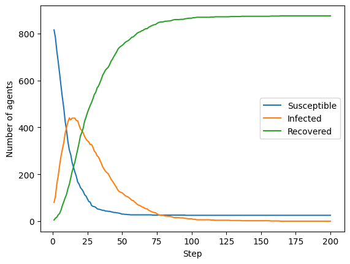

# BMI 500 Week 11 Homework

### Name and contact

- Darren (Sizuo) Liu

- darren.liu@emory.edu

### Question number

HW2: `Agent-Based Modeling of Pandemic Spread`

### Key insights

Given that a 75 * 75 grid is pretty big and 100 agents are distributed quite evenly, it's hard to get infected with a low p value. When p is 0.05 and 0.02, the overall trand is that no one gets infected, and the agents already infected recover over time.

When we populate the environment with more agents and shrink the size of the enironment, we see that more agents get infected first, and then less agents get infected and more infected agents are recovered. An extreme situation is when p = 0.8, q = 0.05, grid size = 30 * 30, and the environment is populated with 900 agents. The infection peak is usually around 20 steps, and then gradually reduce to 0.

### Comparative model performance

When social distancing measures are applied, we see a significant reduction in infection rate and peak. However, the time to reach peak remains almost the same.

When applied a bigger p and smaller q, both the infection rate and peak increased. When populating more agents, and shrink the environment size, both the infection rate and peak also increased.

### Relevance to model-based machine learning

The parameters we adjusted in this experiment are interpretable features that can reflect real-world senarios. Simulating under different parameters can help us collect data that is usually hard to get without simulations.

### Suggestions for future modeling improvements

Social network can be added to the model where agents marked as "friends" tend to move towards each other. Adding more interactions with the environment can also reflect more real-world senarios, such as adding popular spots that people tend to move towards.

### Disclaimer

No generative AI (in any form) has been used to complete this homework.